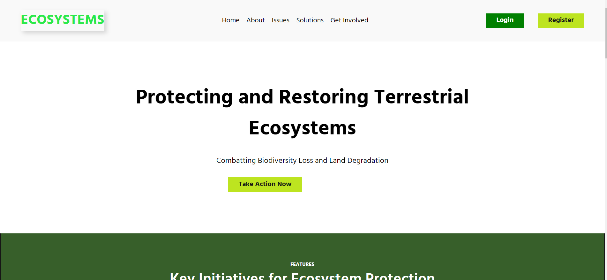

# Ecosystems
https://sayakdeepghosh01.github.io/Ecosystems/
## 🌿 Welcome to Ecosystems, a website dedicated to protecting and restoring terrestrial ecosystems!

## About

ℹ️ Our website aims to address the pressing issues of biodiversity loss, desertification, and land degradation. We provide information on key initiatives, solutions, and ways to get involved in ecosystem protection.

## Key Features

🚀 Explore our website's features:
- **Home**: Landing page with overview and updates
- **About**: Learn about our mission and team
- **Issues**: Understand the challenges we face
- **Solutions**: Discover strategies for ecosystem protection
- **Get Involved**: Find out how you can contribute
- **Login/Register**: Access member-exclusive content
- **Pricing**: Choose a plan to support our cause

## Pricing Plans

💰 Select a plan that suits your needs:
- **Free**: Limited access for individuals
- **Basic**: Ideal for small organizations
- **Pro**: Comprehensive package for large organizations

## Tech Stack

🛠️ We use the following technologies:
- HTML
- CSS
- JavaScript
- Firebase

## Contributors

👨‍💻 Meet the contributors behind Ecosystems:
- Sayak Ghosh: B.Tech Final Year Student, Future Institute of Engineering, GDSC Core Team Member
- Sanglap Mridha: B.Tech Final Year Student, Future Institute of Engineering, GDSC Lead

## Join Us

🌍 Join us in preserving Earth's biodiversity! Immediate action is needed to ensure a sustainable future for all life on Earth.

---
[Watch the Video](https://youtu.be/nDNLd_H-Fyg)

🔗 **[Learn More](#)** | 📃 **[FAQ](#)** | 📞 **[Contact Us](#)**
